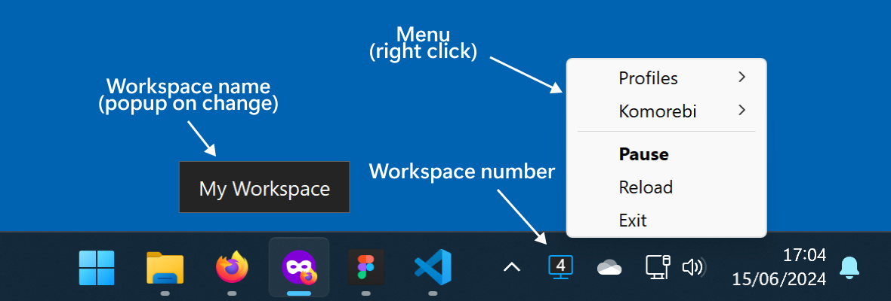

#  komorebi-tray

A tray app to manage komorebi tiling window manager for Windows. 

- Switch between multiple AutoHotkey configuration profiles.
- Start, Stop or Pause komorebi using the tray menu.
- Click on the tray icon to Pause/Resume komorebi.
- Show the current workspace number on tray icon.
- Show workspace name popup on workspace change.



## How to start

Install komorebi following the official [Getting Started](https://lgug2z.github.io/komorebi/installation.html) documentation.

Set `KOMOREBI_CONFIG_HOME` in your `Microsoft.PowerShell_profile.ps1`.

```powershell
# Locate your PowerShell profile:
echo $PROFILE

# Edit your PowerShell profile:
ii $PROFILE
```

```powershell
# Microsoft.PowerShell_profile.ps1
$Env:KOMOREBI_CONFIG_HOME = "$($Env:USERPROFILE)\.config\komorebi"
```

## AutoHotkey profiles

Add custom `*.ahk` scripts to `$Env:KOMOREBI_CONFIG_HOME\profiles\` folder.

```autohotkey
; custom_profile.ahk
#Requires AutoHotkey v2.0
#SingleInstance Force
#NoTrayIcon

Komorebic(cmd) {
  RunWait(format("komorebic.exe {}", cmd), , "Hide")
}

; Custom hotkeys below
...
```

Load new added scripts: `Right click -> Reload`.

Enable your profiles using the app's tray icon: `Right click -> Profiles -> profile.ahk`.
